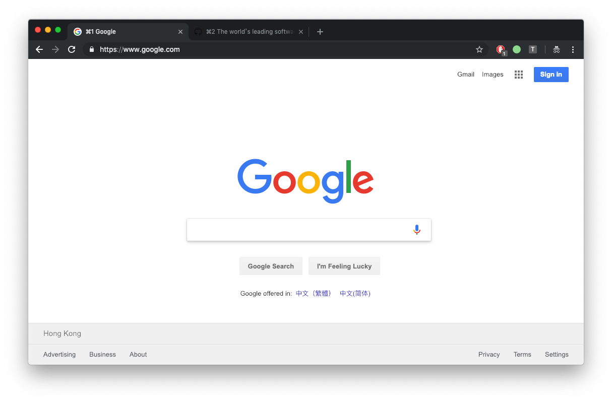

# tabber

Show the index number in tab title, just like iTerm2

## Install

- git clone this repo
- go to [chrome://extensions/](chrome://extensions/)
- open `developer mode`
- `Load unpacked extension` and navigate to the extension folder

## Usage
Open a new tab and go to a web page, you could see the number in tab title.
